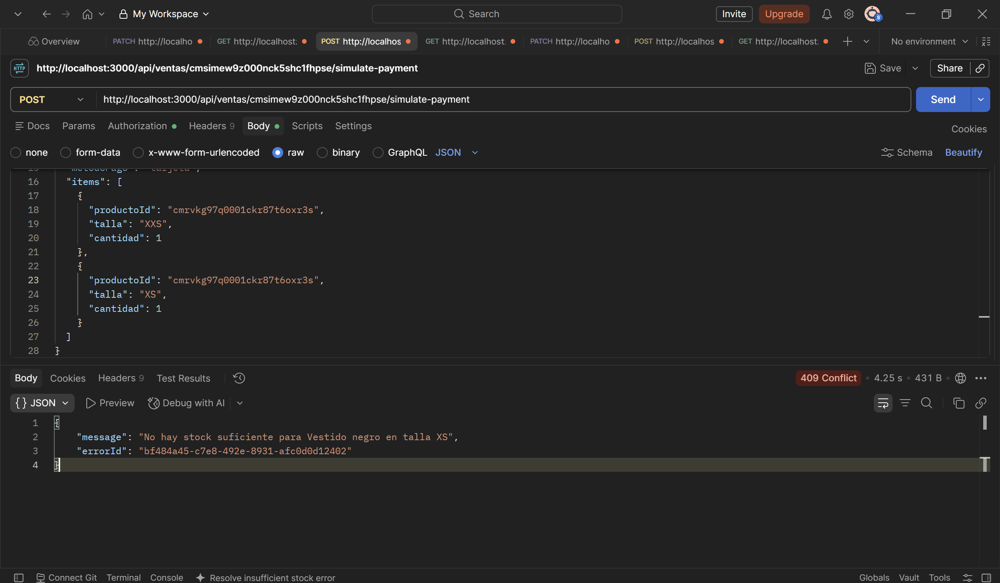
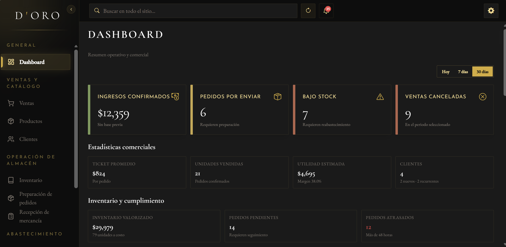
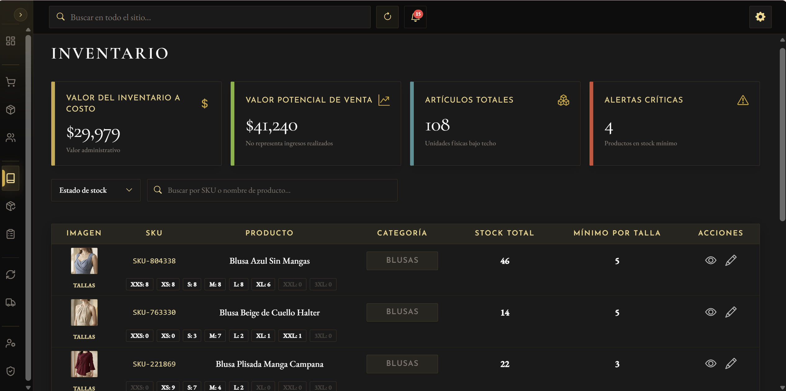
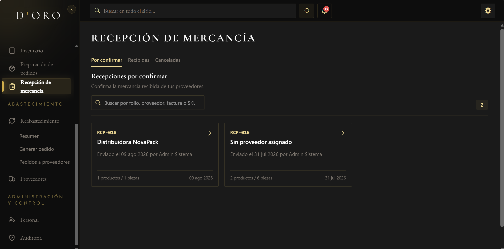
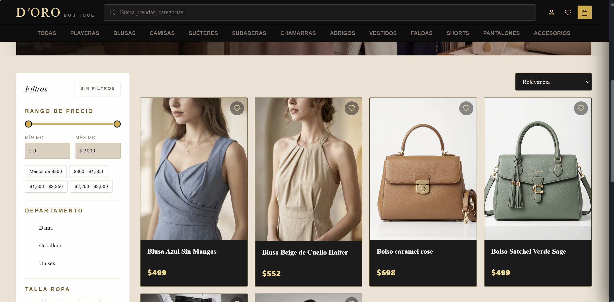

# D'oro Fashion System

D'oro Fashion System is a full-stack retail platform that connects a customer-facing fashion store with the internal sales, inventory, fulfillment, procurement, and administration workflows of a clothing business.

## Live Demo

- [Application](https://doro-fashion-system.vercel.app)
- [QA Case Study](qa/README.md)

## Project Overview

D'oro centralizes operations that would otherwise be handled in separate tools or disconnected records. Customer purchases feed the same inventory used by staff; paid orders move into warehouse fulfillment; low-stock information supports supplier orders; confirmed merchandise receipts update stock; and staff actions are governed by permissions and recorded in audit logs.

The application has two connected contexts:

1. **Customer Store** — a public catalog and authenticated shopping experience with customer accounts, cart, wishlist, checkout, addresses, simulated payment, and access to the customer's own orders.
2. **Internal Management System** — a permission-aware workspace for sales, products, size-level inventory, fulfillment, replenishment, supplier orders, receiving, customers, suppliers, staff, notifications, and auditing.

Current sales scope: customer sales originate through the online store. D'oro does not currently include a physical point-of-sale (POS) or in-store cashier workflow; the internal Sales module is used to monitor and manage customer orders created through the e-commerce flow.

Changes originating in the store propagate through warehouse, purchasing, and administrative processes, keeping business state and inventory effects consistent across the system.

## Main Operational Workflows

### Customer order lifecycle

```text
Catalog and checkout
        ↓
Sale created as PENDIENTE (inventory is unchanged)
        ↓
Owner confirms simulated payment
        ↓
Sale becomes PAGADO; size-level stock is deducted atomically
and SALIDA movements are recorded
        ↓
Authorized warehouse staff dispatch the order
        ↓
Sale becomes ENVIADO, preparation becomes PREPARADO,
and shipping starts as EN_TRANSITO
        ↓
Shipping status can be updated to EN_TRANSITO, ENTREGADO, or INCIDENCIA
```

Payment is rejected if any requested `ProductVariant` lacks stock. Because payment and inventory writes run in one database transaction, no item is deducted and no movement remains if any line fails. A `PENDIENTE` or `PAGADO` sale may be cancelled; cancelling a paid sale restores its stock and records `ENTRADA` movements.

### Replenishment and receiving lifecycle

```text
Low-stock summary by product and size
        ↓
Supplier order created as BORRADOR with origin REABASTECIMIENTO
        ↓
Authorized staff send it → ENVIADA
        ↓
Warehouse staff register every received line and its actual cost
        ↓
Confirmation runs in one transaction → CONFIRMADA
        ↓
Received quantities increase ProductVariant stock
and generate ENTRADA movements
```

Received quantities may be lower than ordered quantities, but every line must be reported. Only positive received quantities change inventory. Supplier orders can be cancelled while `BORRADOR` or `ENVIADA`; a confirmed receipt is final for that order.

### Access-control lifecycle

```text
Client or staff authentication
        ↓
JWT account type (CLIENT or STAFF)
        ↓
Active account and role loaded from the database
        ↓
ADMIN global access or BODEGUERO effective permissions
        ↓
Frontend navigation filtering + backend endpoint authorization
```

The backend is the authorization boundary. Frontend route and navigation checks provide a consistent interface, while API middleware independently validates the account type and the permissions required for each operation.

## Main Features

### Internal Management

- **Dashboard** — business metrics, low-stock indicators, recent sales, and recent staff activity.
- **Sales** — customer-order search, filtering, state management, cancellation, and inventory traceability.
- **Products** — catalog data, images, purchase and sale prices, supplier relationships, sizes, and availability.
- **Customers and suppliers** — commercial records used by sales, products, and purchasing workflows.
- **Staff management** — fixed internal roles, active status, password administration, and individual warehouse permission adjustments.
- **Audit logs** — searchable records for staff actions across authentication, users, permissions, products, inventory, sales, receiving, fulfillment, customers, and suppliers.

### Inventory and Warehouse Operations

- **Size-level inventory** — stock is persisted in `ProductVariant` records and summarized at product level.
- **Inventory adjustments** — controlled stock changes with `ENTRADA` or `SALIDA` movements and an audit record.
- **Order fulfillment** — paid orders are prepared, dispatched with a simulated guide, and tracked through shipping states.
- **Merchandise receiving** — ordered and received quantities, actual unit costs, supplier invoices, inventory entries, and missing-item reporting.
- **Operational notifications** — current-state alerts for low stock, orders awaiting preparation, supplier orders awaiting receipt, and purchase-cost reviews when applicable.

### Procurement

- **Replenishment summary** — product and size information used to identify restocking needs.
- **Supplier orders** — draft creation, sending, cancellation, and status tracking using the receiving domain model.
- **Purchase-cost review** — administrator-confirmed cost changes can flag products for sale-price review; warehouse confirmation does not change purchase prices.

### Customer Store

- Public product catalog, product detail, filters, and size availability.
- Customer registration, email/password login, optional Google authentication, and password changes.
- Account-scoped cart and wishlist stored in the browser.
- Checkout with saved delivery addresses and simulated shipping costs.
- Order creation, owner-only simulated payment, order history, and shipment tracking.
- Customer profile and customer-owned address management.

## Roles & Authorization

### ADMIN

`ADMIN` is an internal staff role with global access to registered staff permissions. Administrators manage catalog and commercial data, sales, inventory, fulfillment, procurement, receiving, staff, permissions, and audit information. Certain permission-catalog operations additionally require the designated primary administrator.

### BODEGUERO / Warehouse Staff

`BODEGUERO` is an internal warehouse role. Its seeded base permissions cover inventory reading and adjustment, pending-reception reading and confirmation, and fulfillment reading and updates. Effective access can be refined with individual grants and revocations; administrative permission groups such as users, roles, permissions, and audit cannot be individually granted to this role.

### CUSTOMER

`CLIENTE` is presented by the application for a separate `Client` account type rather than an internal staff role. Customers can browse the public catalog, manage their own store account and addresses, create orders, view their own orders, and confirm simulated payment only for an order they own. Staff-only permission middleware rejects customer accounts.

## Architecture

```text
React 19 + Vite 8 single-page application
                    ↓
                 REST API
                    ↓
          Node.js + Express 5 API
                    ↓
               Prisma ORM 6
                    ↓
          PostgreSQL database (Neon)

Browser ───────────────→ Cloudinary
       product images, invoices, and inventory evidence
```

The public frontend is deployed on Vercel and includes SPA rewrite configuration. The backend is deployed separately and selected through `VITE_API_URL`; runtime and migration connections use pooled and direct Neon PostgreSQL URLs respectively. The repository does not publish deployment secrets or a backend service URL.

## Tech Stack

### Frontend

- React 19, React DOM, and React Router
- Vite 8 and JavaScript
- Tailwind CSS 4 and daisyUI
- React Hook Form with Zod validation
- Recharts, Lucide React, and Bootstrap Icons
- ExcelJS, jsPDF, and FileSaver for client-side exports

### Backend

- Node.js with ECMAScript modules
- Express 5 REST API
- Prisma ORM 6
- Zod request validation
- JSON Web Tokens and bcryptjs
- Google ID token verification for optional customer authentication

### Database and Infrastructure

- PostgreSQL hosted on Neon
- Vercel frontend hosting
- Cloudinary uploads for product images, supplier invoices, and inventory evidence
- Environment-based API, database, authentication, CORS, Google, and Cloudinary configuration

### Quality and Development

- Native Node.js test runner
- ESLint
- Postman and Prisma Studio for documented manual API and persistence checks
- Git and GitHub
- GitHub Actions for continuous integration

## Quality Assurance

D'oro also serves as a practical QA case study for validating business rules, authorization, API behavior, database persistence, inventory integrity, and connected operational workflows.

| Validation | Result |
|---|---:|
| Automated tests | **79 / 79 PASS** |
| Backend automated tests | **60 / 60 PASS** |
| Frontend automated tests | **19 / 19 PASS** |
| Manual Sales & Inventory suite | **16 / 16 PASS** |
| ESLint | **0 errors / 0 warnings** |
| Production frontend build | **PASS** |
| GitHub Actions CI | **PASS — Backend + Frontend** |

The production build currently reports Vite's warning for chunks larger than 500 kB. One open defect is documented in the QA portfolio; the results above do not claim end-to-end coverage or a coverage percentage.

### Testing Areas

- Functional, negative, boundary, API, database, integration, and regression testing
- Authorization and account-type separation checks
- Business-rule and state-transition validation
- Inventory movement, data-integrity, and transaction-atomicity validation
- Structured execution evidence and defect reporting

[View the complete QA case study →](qa/README.md)

## Featured QA Scenario

### Atomic payment for a multi-item sale

`TC-SI-012` validated the risk of partially updating inventory during payment. The test used a `PENDIENTE` sale with two size variants of the same product: one still had sufficient stock and the other had become unavailable before payment.

The expected rule was all-or-nothing processing. The API rejected payment because of the insufficient line; the available variant was not deducted, the unavailable variant did not become negative, the sale remained `PENDIENTE`, and no new inventory movement was persisted. The result was verified through the API, inventory state, movement records, and database persistence evidence.



[Read the test case](qa/test-cases/TC-SALES-INVENTORY.md#tc-si-012) · [Review the execution record](qa/test-runs/TR-SALES-INVENTORY-001.md#registro-de-ejecución--tc-si-012) · [View the concise evidence](qa/evidence/TR-SI-001/TC-SI-012-atomicity-result.txt)

## Testing Strategy

The current strategy combines native Node.js regression suites with executed manual scenarios, API checks, direct PostgreSQL persistence validation through Prisma Studio, and focused authorization and business-rule testing. Formal evidence is kept with the execution record instead of being duplicated in this README.

- [Test Plan](qa/test-plan/doro-test-plan.md)
- [Manual Test Cases](qa/test-cases/TC-SALES-INVENTORY.md)
- [Test Run](qa/test-runs/TR-SALES-INVENTORY-001.md)
- [Execution Evidence](qa/evidence/TR-SI-001/)
- [Open Defect](qa/defects/BUG-AUTH-001.md)
- [SQL Validation Queries](qa/database/validation-queries.sql)
- [Postman QA Collection](qa/api/postman/README.md)
- [GitHub Actions CI](.github/workflows/ci.yml)

## Deployment

- **Public application:** [doro-fashion-system.vercel.app](https://doro-fashion-system.vercel.app)
- **Frontend:** Vercel-hosted React/Vite SPA with client-side route rewrites.
- **Backend:** separately deployed Express API configured at build time through `VITE_API_URL`.
- **Database:** Neon PostgreSQL, with separate pooled runtime and direct migration connections.
- **File uploads:** Cloudinary, configured entirely through environment variables.

No credentials, tokens, connection strings, or private service URLs are committed to this documentation.

## Screenshots

### Administrative Dashboard

Operational overview with confirmed revenue, pending fulfillment, low-stock alerts, cancellations, and inventory indicators.



### Size-Level Inventory

Inventory management with product variants, size-level stock, inventory valuation, critical stock alerts, and product-level controls.



### Warehouse Receiving

Pending supplier orders awaiting merchandise confirmation, connecting procurement with warehouse receiving and inventory updates.



### Customer Store

Customer-facing catalog connected to the same products and inventory managed through the internal system.




## Repository Structure

```text
backend/    Express REST API, business services, Prisma schema, migrations, and tests
frontend/   React/Vite customer store and internal management interface
qa/         QA plan, manual cases, execution record, evidence, and defect report
```

## Local Development

### Requirements

- Node.js `20.19+` or `22.12+` (required by the installed Vite version)
- npm
- A PostgreSQL database; the project configuration supports Neon pooled and direct connections

### 1. Install dependencies

```powershell
cd backend
npm ci

cd ../frontend
npm ci
```

### 2. Create local environment files

From the repository root:

```powershell
Copy-Item backend/.env.example backend/.env
Copy-Item frontend/.env.example frontend/.env
```

Complete both files with your own development values. The backend uses `DATABASE_URL` for the running API and `DIRECT_URL` for Prisma migrations. The frontend's `VITE_API_URL` must include the `/api` prefix. Google and Cloudinary values are required only for their corresponding integrations.

Use placeholders or local credentials only; never commit `.env` files. On Windows, omit `channel_binding=require` from PostgreSQL URLs. `sslmode=require` remains in the provided Neon-style examples, and the Prisma configuration removes the incompatible channel-binding parameter before migrations.

### 3. Prepare the development database

```powershell
cd backend
npm run prisma:generate
npm run prisma:migrate:dev
npm run prisma:seed
```

`prisma:seed` initializes the fixed `ADMIN` and `BODEGUERO` roles and their permissions. On a completely empty database, it requires explicit `PRIMARY_ADMIN_EMAIL`, `PRIMARY_ADMIN_USUARIO`, and `PRIMARY_ADMIN_PASSWORD` environment values; use your own local placeholders and do not publish them.

Use `npm run prisma:migrate:dev` only against a development database. Deployment environments must use:

```powershell
npm run prisma:migrate:deploy
```

### 4. Start the application

Run the services in separate terminals:

```powershell
# Terminal 1
cd backend
npm run dev
```

```powershell
# Terminal 2
cd frontend
npm run dev
```

The default examples use `http://localhost:3000/api` for the API and `http://localhost:5173` for the frontend. Check API availability at `GET http://localhost:3000/api/health`.

### 5. Verify the project

```powershell
# Backend tests and migration status
cd backend
npm test
npm run prisma:status
```

```powershell
# Frontend tests, static analysis, and production build
cd frontend
npm test
npm run lint
npm run build
```

The current `lint` script includes ESLint's `--fix` option and may format source files when run.

## Language Note

The repository's primary documentation is in English. The interface, some code identifiers, and detailed test-execution artifacts remain in Spanish because D'oro was designed and tested in a Mexican retail context. Portfolio-level QA documentation is presented in English for broader accessibility. This language choice does not change the system architecture, authorization model, or engineering and QA practices.

## What This Project Demonstrates

As a portfolio project, D'oro demonstrates the design of interconnected retail workflows, separate customer and staff authentication, role- and permission-aware authorization, transactional inventory rules, consistency between API responses and database state, and structured QA through plans, cases, execution evidence, regression checks, and defect reporting.

## Author

Elvia Gutiérrez García
